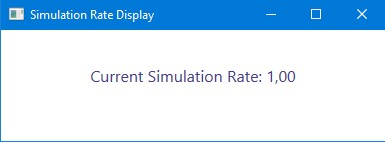

# SimRateDisplay

This is a very simple program that displays the current simulation rate of Microsoft Flight Simulator 2020. I found it to be useful when flying long distances and using the time acceleration feature to speed up the flight. When landing though, I didn't see the simulation rate displayed anywhere in the simulator, so I had to guess when it was back to normal speed. This program displays the current simulation rate in a small window on the desktop, so you can always see it and avoid any surprises.

It is written in C# and uses the SimConnect API to communicate with the simulator.

## Installation

Download the latest release from the [releases page](https://github.com/dikayx/simratedisplay/releases) and extract the contents of the zip file to a folder of your choice. Run `SimRateDisplay.exe` to start the program.

## Usage

Start Microsoft Flight Simulator 2020 and wait for it to load the main menu. Then start `SimRateDisplay.exe`. The program will connect to the simulator and display the current simulation rate - nothing more, nothing less.

## Building

If you want to build the program yourself, you need to have Visual Studio and the Flight Simulator SDK installed. Follow [this guide](https://docs.flightsimulator.com/html/Introduction/SDK_Overview.htm) to install the SDK.

## License

This program is licensed under the MIT license. See the [LICENSE](LICENSE) file for more information.

## Disclaimer

This program is not affiliated with Microsoft or Asobo. It is provided as-is and without any warranty. Use at your own risk.
